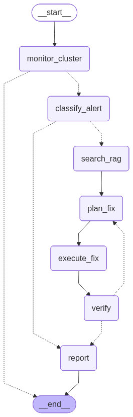

# AI Alert Remediation Agent — Architecture

## What is LangGraph?

LangGraph is a framework for building stateful, multi-step AI agents as directed graphs.
The key idea is simple: instead of writing a linear script that calls an LLM once, you model
your agent as a **graph** where each **node** is a function (or an LLM call), and **edges**
define how execution flows from one step to the next.

This gives you:
- **State** that accumulates across steps — every node reads and updates a shared dict
- **Conditional routing** — the next node to execute depends on what happened in the current one
- **Cycles** — unlike a DAG, you can loop back (e.g. retry a fix up to 3 times)
- **Observability** — the graph can be rendered as a diagram, making the logic easy to inspect

---

## The Three Core Concepts

### 1. State (`AgentState`)

The state is a `TypedDict` that lives for the entire duration of one graph invocation.
Every node receives the current state and returns a partial dict of the fields it wants to update.
LangGraph merges those updates in before passing the state to the next node.

```python
class AgentState(TypedDict):
    alerts: list[dict]        # all unhealthy pods found
    current_alert: dict       # the alert currently being remediated
    alert_type: str           # IMAGE_PULL_BACKOFF | MISSING_SECRET | UNKNOWN
    solutions: list[str]      # runbook chunks retrieved from ChromaDB
    fix_plan: str             # structured JSON fix plan from the LLM
    fix_result: str           # outcome of the Kubernetes API call
    retry_count: int          # how many fix attempts have been made
    verified: bool            # whether the pod recovered after the fix
    report: str               # final human-readable summary
    messages: list            # LangChain message history (auto-appended)
```

### 2. Nodes

Each node is a plain Python function with the signature:

```python
def my_node(state: AgentState) -> dict:
    ...
    return {"field_to_update": new_value}
```

The function does its work (calls an LLM, queries Kubernetes, searches a vector DB…) and
returns only the fields it changed. LangGraph patches those into the shared state.

### 3. Edges

There are two kinds:

| Kind | When to use |
|------|-------------|
| `add_edge(a, b)` | Always go from node `a` to node `b` |
| `add_conditional_edges(a, fn, map)` | Call `fn(state)` to decide the next node |

Conditional edges are what give the agent its decision-making power.

---

## The Graph Topology

```
__start__
    │
    ▼
monitor_cluster ──(no alerts)──────────────────────────────► __end__
    │
    │ (alerts found)
    ▼
classify_alert ──(UNKNOWN type)──────────────────────────► report
    │                                                          ▲
    │ (known type)                                             │
    ▼                                                          │
search_rag                                                     │
    │                                                          │
    ▼                                                          │
plan_fix ◄─────────────────────────────(retry, count < 3)─────┤
    │                                                          │
    ▼                                                          │
execute_fix                                                    │
    │                                                          │
    ▼                                                          │
verify ──(verified OR retries exhausted)──────────────────────┘
```



---

## Node by Node

### `monitor_cluster`
**What it does:** Queries the Kubernetes API for pods in a non-Running/Ready state in the
watched namespace. Builds a list of structured alert dicts:
`{pod, namespace, container, reason, message}`.

**Routing:**
- No alerts found → `__end__` (nothing to do)
- At least one alert → `classify_alert` (process the first one)

**Implemented in:** Story 2.4 — `agent/nodes/monitor_cluster.py`

---

### `classify_alert`
**What it does:** Sends the raw alert `reason` and `message` to the Qwen LLM (via the
KServe OpenAI-compatible endpoint) and asks it to assign one of three canonical labels:

| Label | Meaning |
|-------|---------|
| `IMAGE_PULL_BACKOFF` | Wrong image tag or missing pull secret |
| `MISSING_SECRET` | Pod references a secret that does not exist |
| `UNKNOWN` | Anything else — no automated fix available |

**Routing:**
- `UNKNOWN` → `report` immediately (logs "no automated fix available")
- Any other type → `search_rag`

**Implemented in:** Story 2.5 — `agent/nodes/classify_alert.py`

---

### `search_rag`
**What it does:** Builds a query string from `alert_type` + `current_alert.message` and
retrieves the top-3 most relevant runbook chunks from ChromaDB using cosine similarity.
Embeddings are computed in-process using `nomic-embed-text` via `sentence-transformers`
(no external embedding service).

**Routing:** Always → `plan_fix`

**Implemented in:** Story 2.6 — `agent/nodes/search_rag.py`

---

### `plan_fix`
**What it does:** Prompts Qwen with the full context (alert details + RAG runbook chunks +
list of available fix actions) and asks for a structured JSON fix plan:

```json
{"action": "patch_deployment_image", "target": "my-deploy", "params": {"image": "nginx:latest"}}
{"action": "create_secret",          "target": "my-secret",  "params": {"data": {"key": "val"}}}
```

If the LLM returns invalid JSON it retries once before failing gracefully.

**Routing:** Always → `execute_fix`

**Implemented in:** Story 2.7 — `agent/nodes/plan_fix.py`

---

### `execute_fix`
**What it does:** Parses the fix plan and calls the appropriate Kubernetes API:

| Action | API call |
|--------|----------|
| `patch_deployment_image` | `PATCH apps/v1/deployments/{name}` |
| `create_secret` | `POST core/v1/secrets` |
| `patch_secret_ref` | `PATCH apps/v1/deployments/{name}` |

Uses the agent's in-cluster ServiceAccount token — no hardcoded credentials.

**Routing:** Always → `verify`

**Implemented in:** Story 2.8 — `agent/nodes/execute_fix.py`

---

### `verify`
**What it does:** Polls the affected pod's status every 5 seconds for up to 30 seconds.
A pod is considered fixed when its phase is `Running` and all containers are `Ready`.
Increments `retry_count` on each failed attempt.

**Routing:**
- Pod recovered (`verified = True`) → `report`
- Pod not recovered and `retry_count < 3` → `plan_fix` (generate a new plan)
- Pod not recovered and `retry_count >= 3` → `report` (log failure after max retries)

**Implemented in:** Story 2.9 — `agent/nodes/verify.py`

---

### `report`
**What it does:** Prompts Qwen with the full execution context (alert, classification, RAG
chunks used, fix applied, verified status) and asks for a 3–5 sentence human-readable
summary. The report is printed to stdout (visible in pod logs) and stored in
`AgentState.report` for display in the Jupyter notebook.

**Routing:** Always → `__end__`

**Implemented in:** Story 2.10 — `agent/nodes/report.py`

---

## Implementation Roadmap

| Story | File(s) | Status |
|-------|---------|--------|
| 2.1 — RHOAI Workbench | `k8s/ai-agentic/gpu/workbench-*.yaml` | ✅ Done |
| 2.2 — State schema + graph skeleton | `agent/state.py`, `agent/graph.py`, `agent/nodes/` | ✅ Done |
| 2.3 — RAG knowledge base | `agent/knowledge.py` | 🔲 Todo |
| 2.4 — `monitor_cluster` node | `agent/nodes/monitor_cluster.py` | 🔲 Todo |
| 2.5 — `classify_alert` node | `agent/nodes/classify_alert.py` | 🔲 Todo |
| 2.6 — `search_rag` node | `agent/nodes/search_rag.py` | 🔲 Todo |
| 2.7 — `plan_fix` node | `agent/nodes/plan_fix.py` | 🔲 Todo |
| 2.8 — `execute_fix` node | `agent/nodes/execute_fix.py` | 🔲 Todo |
| 2.9 — `verify` node | `agent/nodes/verify.py` | 🔲 Todo |
| 2.10 — `report` node | `agent/nodes/report.py` | 🔲 Todo |
| 2.11 — RBAC | `k8s/ai-agentic/gpu/agent-rbac.yaml` | 🔲 Todo |
| 2.12 — Containerize + deploy | `agent/Dockerfile`, `k8s/ai-agentic/gpu/agent-*.yaml` | 🔲 Todo |
| 2.13 — Demo: ImagePullBackOff | — | 🔲 Todo |
| 2.14 — Demo: Missing secret | — | 🔲 Todo |

---

## LLM Connectivity

The agent talks to Qwen2.5-7B-Instruct via the KServe vLLM endpoint using the
OpenAI-compatible API. All LLM-using nodes initialise the client the same way:

```python
import os
from langchain_openai import ChatOpenAI

llm = ChatOpenAI(
    model="qwen",
    base_url=os.environ["QWEN_INFERENCE_URL"] + "/v1",
    api_key="unused",
)
```

`QWEN_INFERENCE_URL` is injected as an environment variable in both the workbench
(`k8s/ai-agentic/gpu/workbench-notebook.yaml`) and the agent deployment
(`k8s/ai-agentic/gpu/agent-deployment.yaml`, Story 2.12).

The internal KServe Serverless URL is:
```
http://qwen-predictor.ai-agentic.svc.cluster.local
```
